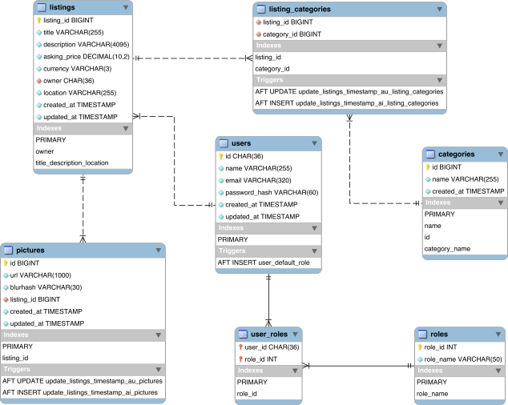

# Marketplace site with Node.js, Express.js, React, MySQL

Built as a final project for Web Programming course at TAMK.

[](https://github.com/TiTe-5G00EV16/2023-final-project-vaasuu/actions/workflows/backend.yml)
[](https://github.com/TiTe-5G00EV16/2023-final-project-vaasuu/actions/workflows/frontend.yml)

## Short feature list

- Secure user registration and login with bcrypt and JWT
- Create, view, update & delete listings
- User roles (normal and admin) with different permissions
- Full text search for listings
- Forgot password functionality
- Users can update their name, email address and password or delete their account
- Admins can access everything

## Tech stack

- Backend: Node.js, Express.js, MySQL
- Frontend: React, React Router, Vite
- Database: MySQL
- CI/CD: GitHub Actions, Render.com
- Testing: Jest, Supertest, React Testing Library, Cypress

## More info in the docs folder

- [Installation](docs/development/installation.md)
- [Project structure](docs/development/project-structure.md)
- [Testing](docs/development/testing.md)
- [Project work stuff](docs/project-work/summary.md)

## Online demo

> **NOTE** database *might* not be running after the course has ended, so you might not be able to log in.
> Also since the backend is running on the free tier of Render, it will need a couple seconds to wake up. 

https://marketplace-frontend-yxv8.onrender.com

## Local demo

```
git clone <repo>
cd <repo>
docker compose up
```

MySQL takes about 1 min to start up, so you might have to wait a bit before the backend and frontend are ready.

| Service  | URL                   |
| -------- | --------------------- |
| Backend  | http://localhost:3000 |
| Frontend | http://localhost:5173 |
| MailDev  | http://localhost:1080 |
| Adminer  | http://localhost:8080 |
| Database | localhost:3306        |

## Database ER diagram



## Video demo

> **Warning** video is 24 minutes long.
> [](https://youtu.be/zx0a1EEBalI)
